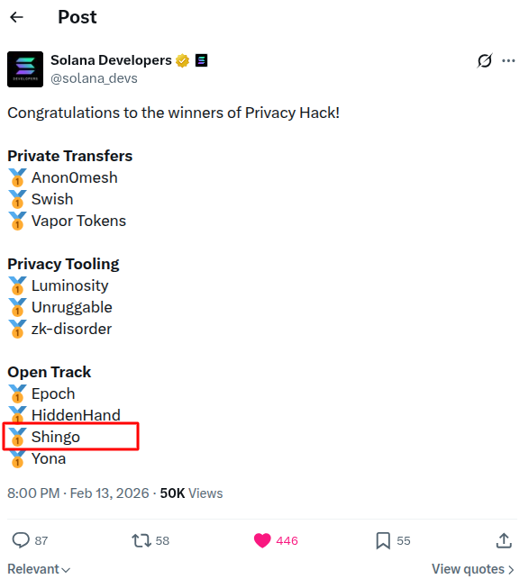
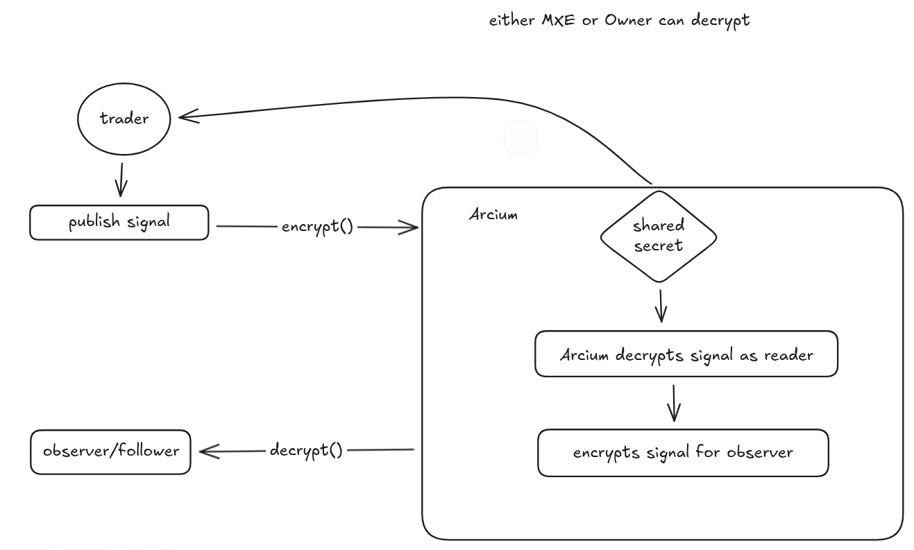
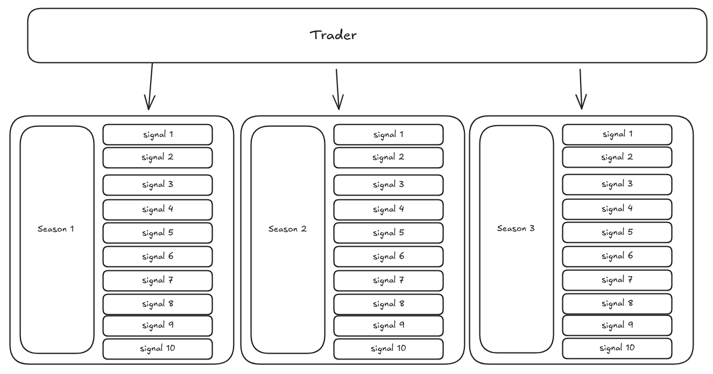
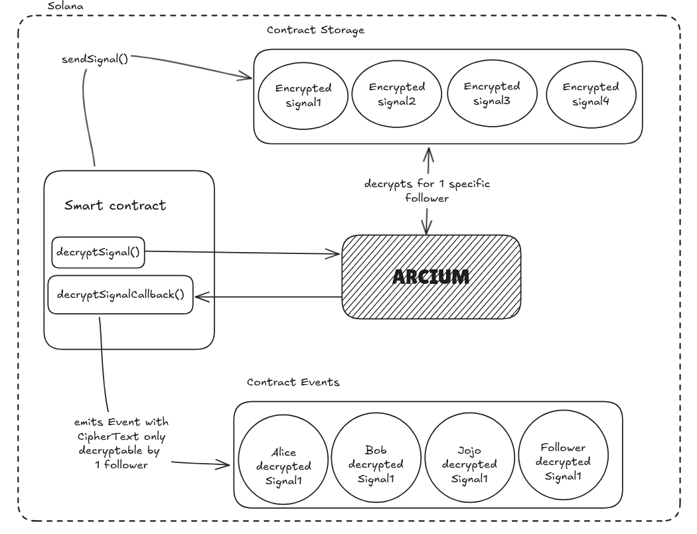

# Shingo Program

> [!IMPORTANT]
> 100% AI-slop free  
> Developed without any vibecoding bullshit

## About

The Shingo Program is the smart contract powering https://shingo.finance

### Winner of the Solana Privacy Hackathon "Open Track" ( Winter 2026 ) 

Solana developers' announcement tweet : https://x.com/solana_devs/status/2022385324714856709 

 

## Using Arcium for decentralized encryption and decryption



## Here's the mental model of the Program

Imagine Netflix, but instead of shows, you've got traders.

Traders have seasons and their seasons have episodes.

Traders publish trading signals ( i.e stock tips ), and these signals are the episodes of the season.




## Shingo



## Devnet address ( ProgramID )

Contract address / ProgramID :

```
7GPHummpkq9W9DXBurQ1rmGESFfeS8gAdqLXUBudpcq9
```

MXE Public key for above contract :

```
21LYCCjVHvbk8A7hB9ruLUoYFhjENEDBcKGWuyiPhR4U
```

Explorer link : https://explorer.solana.com/address/7GPHummpkq9W9DXBurQ1rmGESFfeS8gAdqLXUBudpcq9?cluster=devnet

Orbmarkets link : https://orbmarkets.io/address/7GPHummpkq9W9DXBurQ1rmGESFfeS8gAdqLXUBudpcq9/history?cluster=devnet&hideSpam=true

Solscan link : https://solscan.io/account/7GPHummpkq9W9DXBurQ1rmGESFfeS8gAdqLXUBudpcq9?cluster=devnet

Idl account

```
3mrj8jf5shvKVfapwCCyH71EnVFpqVTBKEMeb3ADYND5
```

All our programs are immutable. If I forgot to make a program immutable, ping me and I'll make it immutable immediately.

## Mainnet address ( ProgramID )

Contract address / ProgramID :

```
(soon)
```

Explorer link : (soon)

Obrmarkets link : (soon)

All our programs are immutable. If I forgot to make a program immutable, ping me and I'll make it immutable immediately.

## The team

Team's address:

```
HhEBDdSK7ywsesAFdMcsQjWiWVBTYbjS386TJAVibMJQ
```

Send some love so the team can deploy on mainnet ❤

SOL : HhEBDdSK7ywsesAFdMcsQjWiWVBTYbjS386TJAVibMJQ

## License

Licensed (c) 2025 Shinsekai Labs . Licensed under BUSL-1.1
